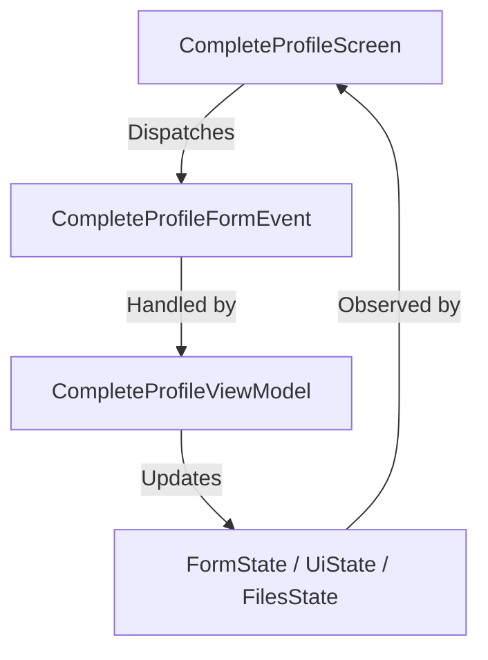
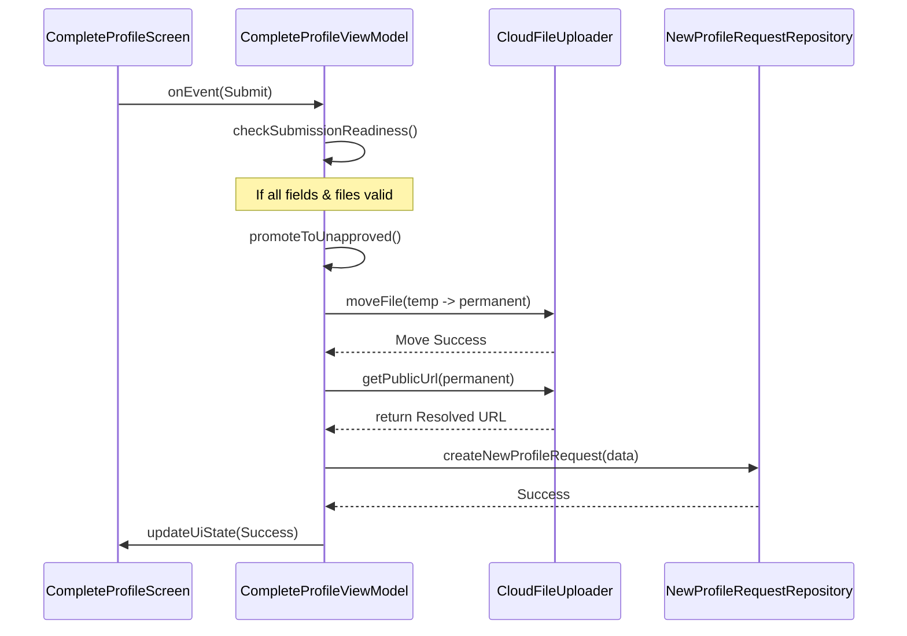

# Complete Profile Feature

## Overview
The **Complete Profile** feature is responsible for collecting and validating comprehensive student data (academic records, addresses, and documents) before allowing them to request a profile update or initialization. It ensures that all required documents are uploaded to cloud storage and all form fields meet specific validation criteria.

## Architecture
This feature follows the **Unidirectional Data Flow (UDF)** pattern, ensuring a predictable state management lifecycle.

### UDF Flow Diagram

### Components
- **`CompleteProfileScreen.kt`**: The UI layer built with Jetpack Compose. It observes state from the ViewModel and dispatches events.
- **`CompleteProfileViewModel.kt`**: The state holder and business logic orchestrator. It manages form data, file upload status, and interaction with repositories.
- **`CompleteProfileFormState.kt`**: A data class representing the state of all text input fields and their respective error messages.
- **`CompleteProfileFormEvent.kt`**: A sealed class defining all possible user interactions (e.g., text changes, file deletions, submission).
- **`DocumentType.kt`**: A sealed class that defines the types of documents supported (`Resume`, `TenthMarksheet`, `TwelfthMarksheet`, `ProfilePic`) and their respective storage folder paths.
- **`FormValidator.kt`**: Contains pure functions for validating user input (Regex, null checks, range validation).

## State Management
The ViewModel maintains three primary streams of state:
1. **`formState`**: Tracks field values (semester, CGPA, etc.) and validation errors.
2. **`uiState`**: Tracks the overall screen status (Loading, Success, Global Errors).
3. **`filesState`**: A map tracking the `UploadState` for each `DocumentType` (upload progress, temporary URLs, file metadata).

## Storage Strategy
To provide a resilient user experience, the feature uses a two-stage storage process:

1. **Temporary Storage (`temp/`)**: 
   - Files are initially uploaded to a `temp/{userId}/{documentType}/` directory.
   - On initialization, the ViewModel attempts to recover any existing files in this directory (`loadExistingTempFiles`), allowing users to resume their progress if the app is closed.
2. **Permanent Storage (`new_profile_request/`)**: 
   - Upon successful form validation, files are moved from `temp/` to `new_profile_request/` using `promoteToUnapproved`.
   - Public URLs are then resolved from these permanent paths to be stored in the database.

## Submission Workflow

### Workflow Diagram

1. **Validation**: When the user clicks "Submit", `checkSubmissionReadiness` validates all fields and file attachments.
2. **Promotion**: If valid, the ViewModel iterates through all documents, moving them to the permanent storage folder.
3. **Persistence**: A `NewProfileRequest` object is constructed using the permanent file URLs and saved to the `new_profile_request_repository`.
4. **Completion**: The UI is notified of success, typically triggering a navigation event.
